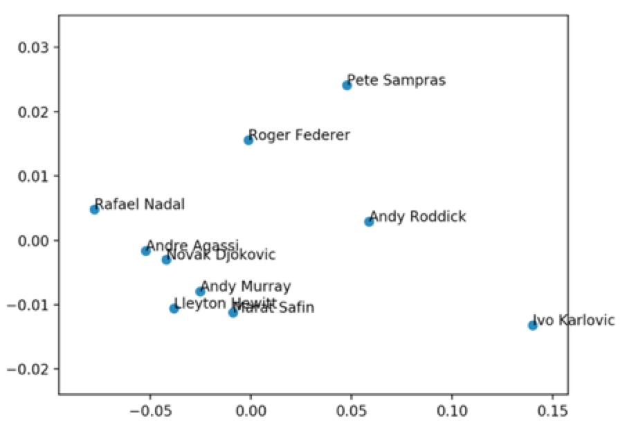
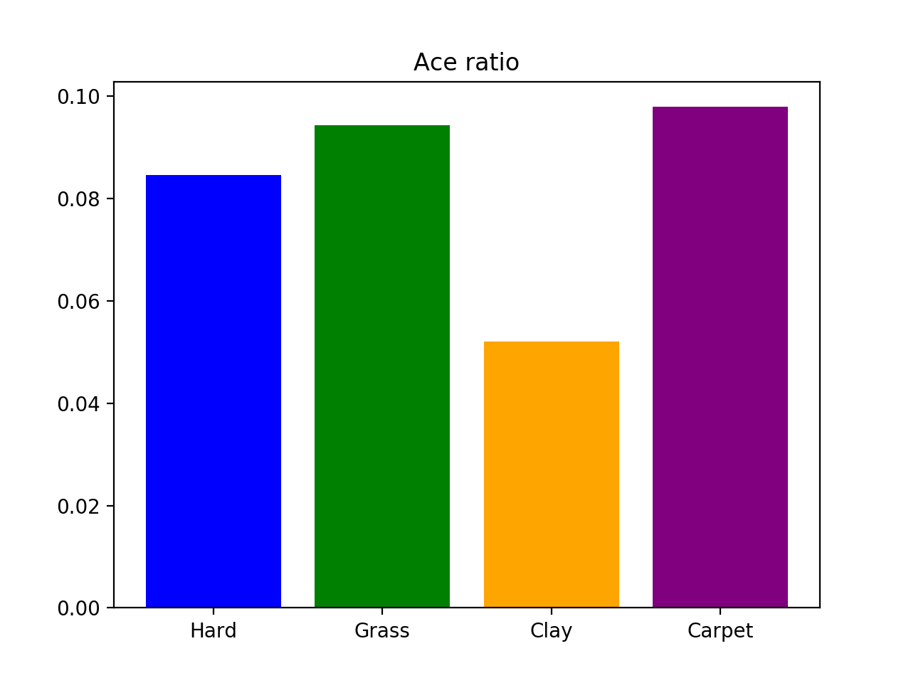
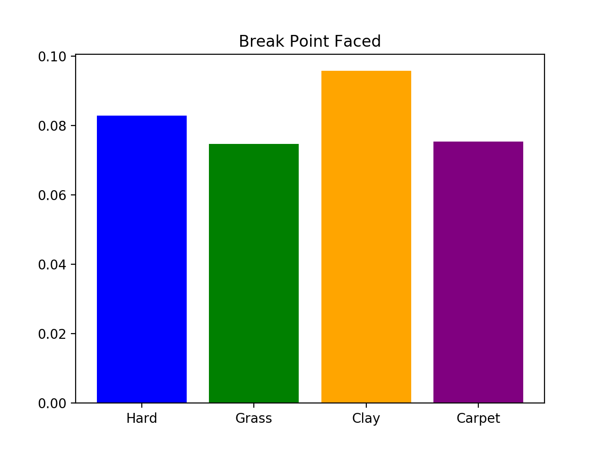
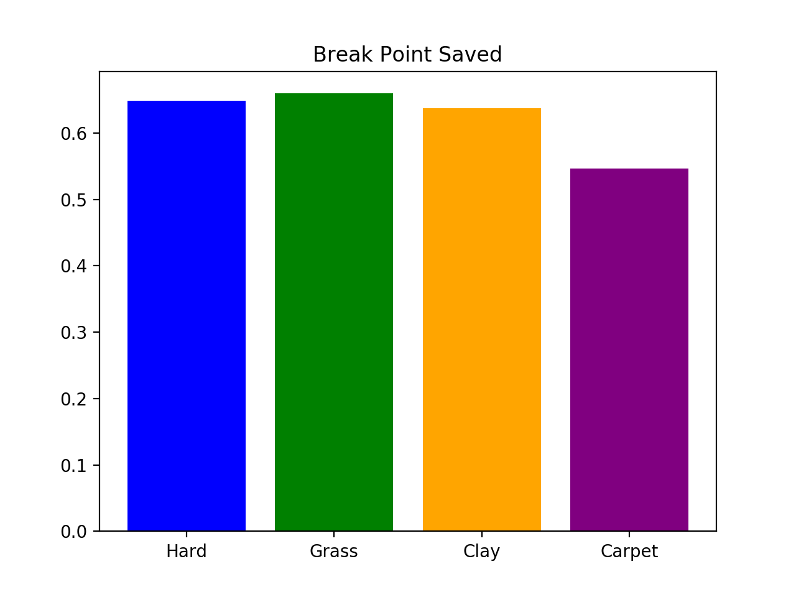
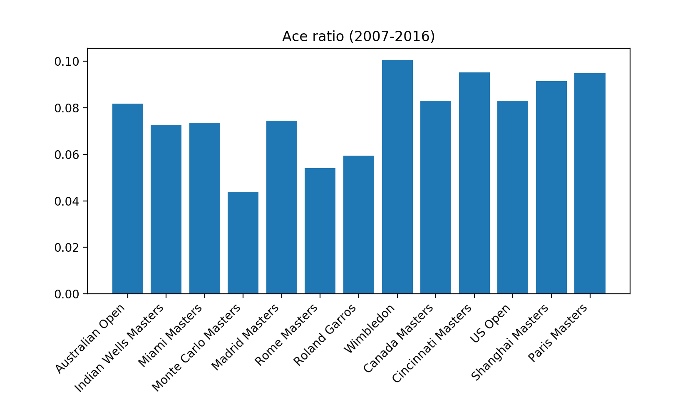

# Basic Analysis of tennis data

In early parts of the projects, basic statistical analysis was done to the dataset of performances of all players recorded from professional matches in ATP tournaments. For example, the abilities of various players in the aspect of serving.

In the later phase of the project, an approach to predict who is going to win the final in tennis tournament was raised by applying machine learning models.

The basic idea and motivation in background is that the performance of the final players in the past 6 matches (in grand slam) may reveal something about their chances to win the championship in the final match.

The features are based on the comparison between two players. The classifier aims at separate the cases that first player wins and second player wins.


* **Correlation**

Let's first look at the abilities of serving of various tennis players. The features that can represent the ability of serving could be: the frequency of aces, breakpoints saving rate, 1st serve won rate. In some sense the 1st serve in rate can be also taken into consideration.  

Data source: the match data from 2000 to 2016. In total 46799 matches.

The correlation matrix of related attributes:


|| ace | df | 1stIn  |1stWon| bpFaced|bpSaved|
|-|--|:-----:| -----:|---:|---:|---:|
|ace|1|0.341444|0.138945|0.917376|-0.721957|-0.567597|
|df| 0.341444|1|-0.570393|0.348611|0.080848|-0.199852|
|1stIn| 0.138945|-0.570393|1|0.157907|-0.617207|-0.004676|
|1stWon|0.917376|0.348611|0.157907|1|-0.843422|-0.662172|
|bpFaced|-0.721957|0.080848|-0.617207|-0.843422|1|0.550028|
|bpSaved|-0.567597|-0.199852|-0.004676|-0.662172|1|

The evident facts are that: aces and 1st serve won are highly correlated, and the more aces one has served, the less break points he needs to face.

* **Players abilities PCA**

Got some descriptions of well-serve players? The first impressions the have come to mind could be: many aces, less double faults, high 1st serve in and high 1st serve won, less breakpoints faced, or high breakpoint saved ratio.

If we consider the above mentioned features and do the principle component analysis in order to visualize the players’ abilities onto a 2-D plane, we can obtain the following:




*  **Basic Statistics**

Ace ratio vs Surfaces:



Break points faced vs Surfaces:



Break points saved vs. Surfaces:




The ace ratio (number of aces/total number of serves) in the recent 10 years show the generally average difficulties of serving an ace during each tournament. Wimbledon ranks the top, naming the tournament in which the aces happen most frequently. Although same as clay tournament as others, in Madrid Masters the players served more aces than in the other clay master tournaments.

Tournaments ace ratio:




* **Fun**

Who can do their 2nd serve in the way of 1st serve?

```
E1 = 1stIn * 1stWon + (1-1stIn) * 2ndIn*2ndWon + 0

Where, 2ndIn = 1 – df/(1-1stIn)

E1 = 1stIn * 1stWon + (1-1stIn-df) * 2ndWon

E2 = 1stIn * 1stWon + (1-1stIn) * 1stIn * 1stWon
```

If E2 > E1, we can say that it is more worthy for the player to do their 2nd serve just the way as their first serve.
In some matches E2 > E1 while in some other ones the opposite.
